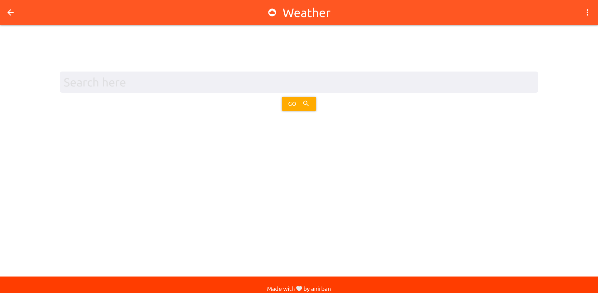
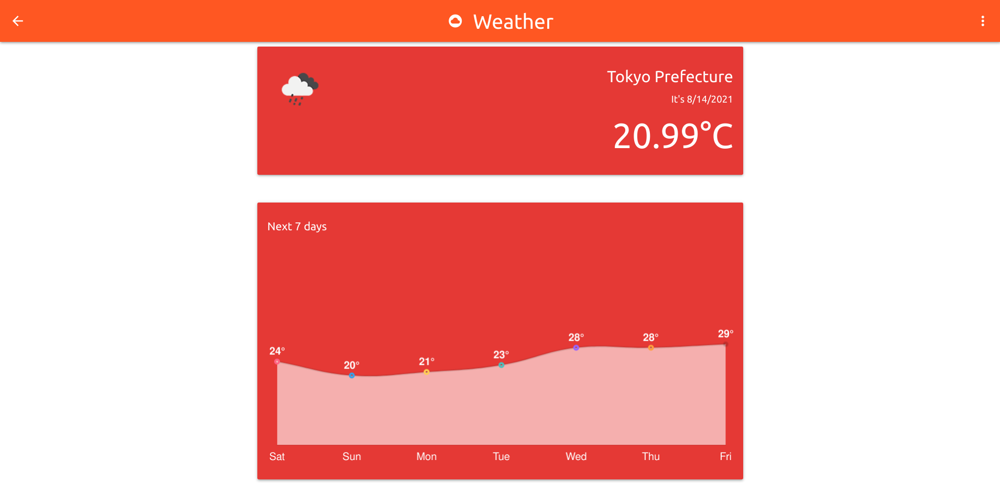

## Weather

A weather checking app built using [OpenWeathermap's](https://openweathermap.org/) API.

 

### User Stories

-   User can search for a location to check it's weather
-   Current temperature of the location is shown alongwith an icon representing the weather
-   A graph of the temperature over the next seven days is displayed

### Built Using

-   Node.js
-   EJS
-   Materialize.css

### Feature ideas for the future

-   Integrate with Google Maps API to show suggestions while typing the location
-   Create a PWA
-   Use Geolocation API to automatically get the location
